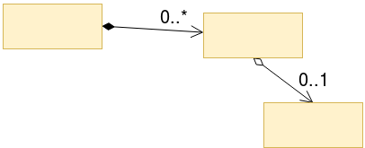
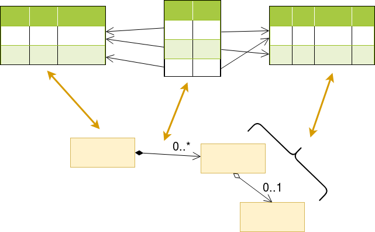
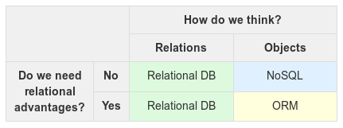

# ORM - WTF?

We will take a look at what is the object-relational mapping and what it is not.
We will show why it is difficult, when to use it and when it's better to avoid it.

## Terms

Let's repeat basic terms so we are on the same page.

### Relational Model

The relational model focuses on data and their representation.
Data are organized in rows and tables.
This is a low-level model for databases.

When we model data, we often think of the entity-relational model and it is fine.
ER model is an abstraction based on the relational model and still focuses on data.

### Object Model

Object model focuses on in-memory objects associated with references.
Class model especially aims at object encapsulation by behavior.

### Relational Database

A relational database is a database based on relational model usually managed by SQL.
We use it when we need transactional consistency, data integrity and when we need to join data relationally.

## Object-relational mapping

ORM is a technique that maps objects to relational data and back.

ORM is not about mapping fields, that would be easy.
It is about mapping the object model to the relational model, and that is a difficult task.
We have to fully understand both models and then we can start finding ways to map them.
We usually find mapping problems that force us to do trade-offs in both models.

And that is the object-relational mapping - no more, no less.
Mapping is pretty difficult, and maintain two models plus maintain the mapping is also a challenge.
ORM library usually cannot do everything we imagine, it is just a fact we have to face.

### Requirements

We must have an object model first.
If we don't have object model and object implementation, we can avoid difficult mapping and use the relational model only.

We must need a relational database.
If we don't need the relational database, we don't have to map objects and our work is much easier.

## Common misuses

When not use the ORM.

### ORM not-Responsibility

ORM isn't responsible for effective database queries.
It shouldn't produce queries at all.
If it produces queries and they aren't effective, we have to use custom queries and don't blame the ORM.

ORM shouldn't be used for reading.
It isn't meant to be reading effective and it isn't its responsibility.
If we need to read information fast, we have to use fast reading techniques, not ORM.

### No Object Model

It may happen that we don't have an object model.
It may have more reasons, but it just happens.
Then we must not create artificial objects just because we can.
The same situation is when we think in relations.

If we try objects anyway, we end up with an anemic model.
ORM becomes a stone that pulls us underwater.
Everything becomes horribly slow and ORM will only make problems.

We can live without the ORM.
We can have only one relational model in the database.
We can query it, work with data.
We don't need to bother with objects and difficult mapping.

### No Need for Relational Database

It may happen that we have a nice object model and we need just to store objects as they are.
There may be no need for inter-aggregate consistency, transactions or joining data.

Then we don't have to bother with relation model and mapping.
We can store objects as they are in a NoSQL database.
Choosing the database can take time but it pays itself.

## TL;DR

Use ORM only if we need to.
Handling two models and mapping is difficult.

## References

FOOTE, Keith D.
A Review of Different Database Types: Relational versus Non-Relational.
*DATAVERSITY* [online].
2016 [2018-01-23].
Available: [http://www.dataversity.net/review-pros-cons-different-databases-relational-versus-non-relational/](http://www.dataversity.net/review-pros-cons-different-databases-relational-versus-non-relational/).

Wikipedia contributors.
Class-based programming.
*Wikipedia, The Free Encyclopedia* [online].
2018 [2018-01-23].
Available: [https://en.wikipedia.org/wiki/Class-based_programming](https://en.wikipedia.org/wiki/Class-based_programming).

Wikipedia contributors.
Object-oriented programming.
*Wikipedia, The Free Encyclopedia* [online].
2018 [2018-01-23].
Available: [https://en.wikipedia.org/wiki/Object-oriented_programming](https://en.wikipedia.org/wiki/Object-oriented_programming).

Wikipedia contributors.
Relational database.
*Wikipedia, The Free Encyclopedia* [online].
2018 [2018-01-23].
Available: [https://en.wikipedia.org/wiki/Relational_database](https://en.wikipedia.org/wiki/Relational_database).

Wikipedia contributors.
Relational model.
*Wikipedia, The Free Encyclopedia* [online].
2018 [2018-01-23].
Available: [https://en.wikipedia.org/wiki/Relational_model](https://en.wikipedia.org/wiki/Relational_model).
